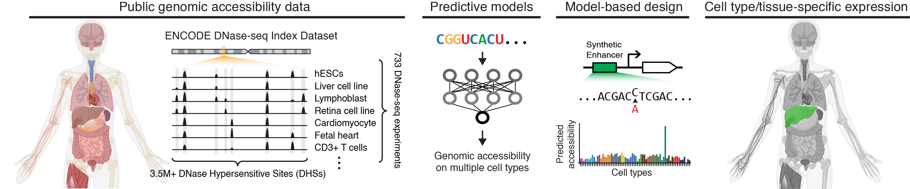

# Programming human cell type-specific gene expression via an atlas of AI-designed enhancers

**Design synthetic enhancers with activity specific to the hundreds of human cell types, tissues, and differentiation states.** Our method uses AI predictors of chromatin accessibility trained on the [DNase I Index dataset](https://doi.org/10.1038/s41586-020-2559-3). The list of potential enhancer targets can be found [here](https://static-content.springer.com/esm/art%3A10.1038%2Fs41586-020-2559-3/MediaObjects/41586_2020_2559_MOESM3_ESM.xlsx).

This repository is part of the following article: Castillo-Hair et al. *Programming human cell type-specific gene expression via an atlas of AI-designed enhancers* (link coming soon).

## Contents

The following main components are part of this project:

- **Sequence-to-function predictors**. The folder [`models`](./models) contains code to train predictors and to download pretrained weights. We use three predictor classes:
    
    - **DHS64**: predicts *chromatin accessibility* across [64 cell and tissue types](https://raw.githubusercontent.com/castillohair/enhancer-design/main/data/dhs_index/dhs64_training/selected_biosample_metadata.xlsx) selected from the DNase I Index.
    - **DHS733**: predicts *chromatin accessibility* across [all 733 samples from the DNase I Index](https://doi.org/10.1038/s41586-020-2559-3), including tissues, cell types, and states.
    - **DH64-MPRA**: predicts *enhancer activity* in 12 human cell lines. Developed by finetuning DHS64 models on activity measurements of ~9,000 enhancers collected by us via Massively Parallel Reporter Assays (MPRAs).

    For each of these, we use three individual models independently trained on different data splits.
    
- **Enhancer design code**. The folder [`design`](./design/) contains code to generate synthetic enhancers using DHS64 or DHS733 as oracles. We use  **Fast SeqProp** ([paper](https://doi.org/10.1186/s12859-021-04437-5), [repo](https://github.com/castillohair/corefsp/)) and **Deep Exploration Networks** ([paper](https://doi.org/10.1016/j.cels.2020.05.007), [repo](https://github.com/castillohair/genesis/)) to optimize sequences. We include code to generate enhancers specific to one or multiple cell types, with maximal or tunable activites.

<!---
- **Analysis of experimental validation results**. We characterized the performance of ~9,000 enhancers, including synthetic ones and natural controls, via MPRAs in 10 target cell lines. The folder [`analysis`](./analysis/) contains code to analyze those results and generate figures in our publication.
-->

- **Pre-designed "atlases" of synthetic enhancers**. We have designed enhancers specific to **every human tissue, cell type, and state** in the DNase I Index: ~32k designed with DHS64 (500 targeting each modeled sample) and ~52.2k designed with DHS733 (200 per unique sample). Due to their size, these atlases are not included with the files in this repository, but a download link will be available here soon.

Additional components include:
- [`data`](./data): Data necessary for model training and analysis.
- [`src`](./src): Python code used across the repository.

Most folders contain their own `README.md` file with more specific information.

## Use cases

### Using pre-designed synthetic enhancers

*Download link to enhancer atlas files will be available here soon!*

Thousands of ready-to-use synthetic enhancer sequences targeting every sample in the DNase I Index have been generated in this project. In general, a user will need to search for a cell type / tissue / cell state that most closely represents the desired target within the [DHS64](./data/dhs_index/dhs64_training/selected_biosample_metadata.xlsx) and [DHS733](https://static-content.springer.com/esm/art%3A10.1038%2Fs41586-020-2559-3/MediaObjects/41586_2020_2559_MOESM3_ESM.xlsx) modeled samples, and find corresponding enhancers in the Atlas files.

Note that a subset of DHS64-designed enhancers has been experimentally validated in cell lines and mouse retina in our publication. We recommend preferentially using these if the cell type of interest can be adequately represented by any of these cell lines, and an experimentally characterized enhancer with the desired activity can be found. Instructions on how to download and read enhancer activity measurements can be found [here](./data/README.md#cell-line-and-mouse-retina-mpra-results).

### Designing new enhancers

Reasons to generate new enhancers beyond the Atlas may include: 1) different enhancer lengths, 2) submaximal target activity, 3) targeting multiple cell types.

To generate new enhancers, install the [required packages](#requirements) and download the appropriate model weights into the [`models`](./models/) folder using the included `download_model_weights.py` script. Then, run the scripts in the [`design`](./design/) folder with the appropriate settings, or modify them as needed.

In addition, we trained generative models called [Deep Exploration Networks](https://doi.org/10.1016/j.cels.2020.05.007) to target each of the DHS64-modeled samples. If the goal is to generate additional enhancers targeted to these samples, pre-trained DENs can be downloaded and used via included scripts.

See the [`design`](./design/) folder's `README` for more information.

### Finetuning accessibility models on enhancer activity data

Our code for finetuning DHS64 models on MRPA data can be found in `finetune.py` inside the [`models/dhs64_mpra`](./models/dhs64_mpra/) subfolder. This script can be used as a starting point to finetune on new enhancer measurements. See [DHS64-MPRA Finetuning](./models/README.md#dhs64-mpra-finetuning) for more information. Make sure to install the [required packages](#requirements) beforehand.

### Reproduce model training

#### Chromatin accessibility models

Model training can be performed via the `train.py` scripts included in the [`models/dhs64`](./models/dhs64/) and [`models/dhs733`](models/dhs733/) subfolders. These can be used to reproduce training of the models used in the article, as well as to train new models on additional data splits we did not originally use. See the [models](./models/) folder's `README` file for more information.

Training data, consisting of processed DNase I Index information, can be downloaded via the included `download_data.py` script in the [`data`](./data) folder. More information can be found in the `data` folder's [README](./data/README.md#data-for-training-accessibility-models) file.

#### Enhancer activity models

Finetuning of the DHS64-MPRA enhancer activity model can be reproduced via the `finetune.py` script in the [`models/dhs64_mpra`](./models/dhs64_mpra/) subfolder, and finetuning on additional data splits can also be performed. See [DHS64-MPRA Finetuning](./models/README.md#dhs64-mpra-finetuning) for more information.

Processed MPRA measurements used for finetuning can be downloaded via the `download_data.py` script in the [`data`](./data/) folder. Necessary information on train/validation/test data splits will also be downloaded. More information can be found in the `data` folder's [README](./data/README.md#cell-line-and-mouse-retina-mpra-results) file.

<!---
### Reproduce publication analysis

Each analysis included in [`analysis`](./analysis/) will have its own workflow and requirements. See the folder's README.md file for more information.
-->

## Requirements

Code was written in Python 3. Dependencies can be installed via `pip install -r requirements.txt`. Some notes on required packages can be found inside the same file.

## Citation

If you use any of the contents of this repository, please cite the following:

Sebastian M. Castillo-Hair, Christopher H. Yin, Leah VandenBosch, Timothy J. Cherry, Wouter Meuleman, Georg Seelig. *Programming human cell type-specific gene expression via an atlas of AI-designed enhancers*.